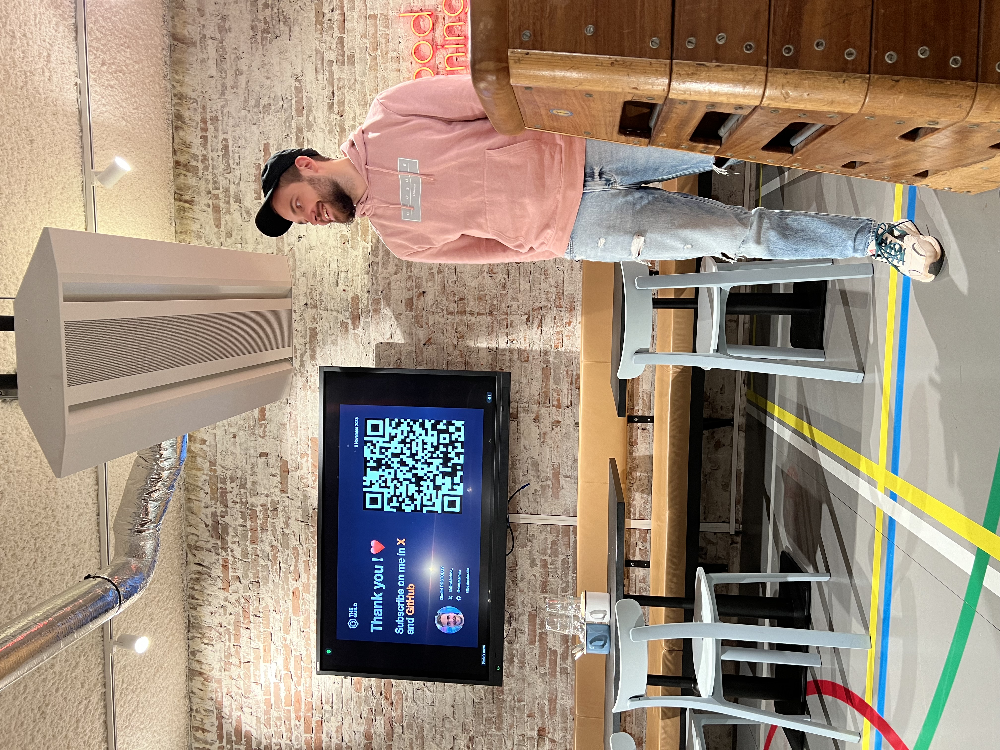

# Talks

## GraphQL Conf 2023

### The New GraphiQL and the Future of Open GraphQL IDEs

<iframe
  className="aspect-video w-full"
  src="https://www.youtube.com/embed/VdHHfrqQUYQ"
  title="YouTube video player"
  allow="accelerometer; autoplay; clipboard-write; encrypted-media; gyroscope; picture-in-picture; web-share"
  referrerPolicy="strict-origin-when-cross-origin"
  allowFullScreen
/>

### Shared Schema Policies and Automatic Standards Across Your Company’s Teams

<iframe
  className="aspect-video w-full"
  src="https://www.youtube.com/embed/tjuVrOhdyGY"
  title="YouTube video player"
  allow="accelerometer; autoplay; clipboard-write; encrypted-media; gyroscope; picture-in-picture; web-share"
  referrerPolicy="strict-origin-when-cross-origin"
  allowFullScreen
/>

## React Amsterdam 2023

### Nextra 3 - MDX Generation Framework with Everything You Love from Next.js

I had a chance to talk about the new major version of Nextra (v3) at [React Amsterdam 2023](https://www.meetup.com/react-amsterdam/photos/33909425), but unfortunately, there was no video recording.

