import { cloneElement } from 'react'
import { useMDXComponents } from '../../mdx-components.js'
import { Bleed as NextraBleed } from 'nextra/components'
import { Masonry } from '../../components/masonry'

# Gallery

{/* prettier-ignore */}
{/*
https://flickr.com/photos/linuxfoundation/54001876780/in/album-72177720320386221
https://flickr.com/photos/linuxfoundation/54001776584/in/album-72177720320386221
https://flickr.com/photos/linuxfoundation/54000552022/in/album-72177720320386221
https://flickr.com/photos/linuxfoundation/54001900903/in/album-72177720320386221
*/}

<Bleed>
## GraphQL Conf 2024

</Bleed>

<Grid>
<></>
<>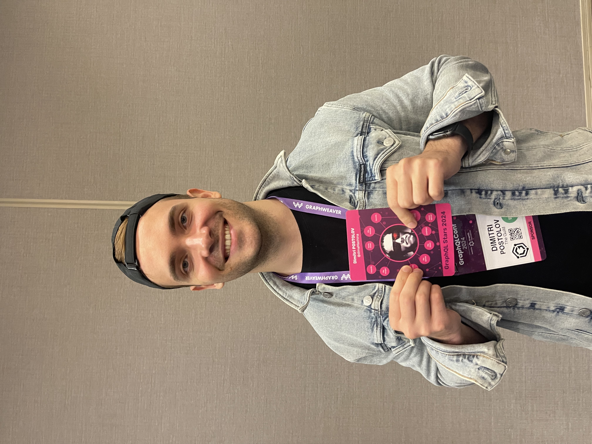</>
<>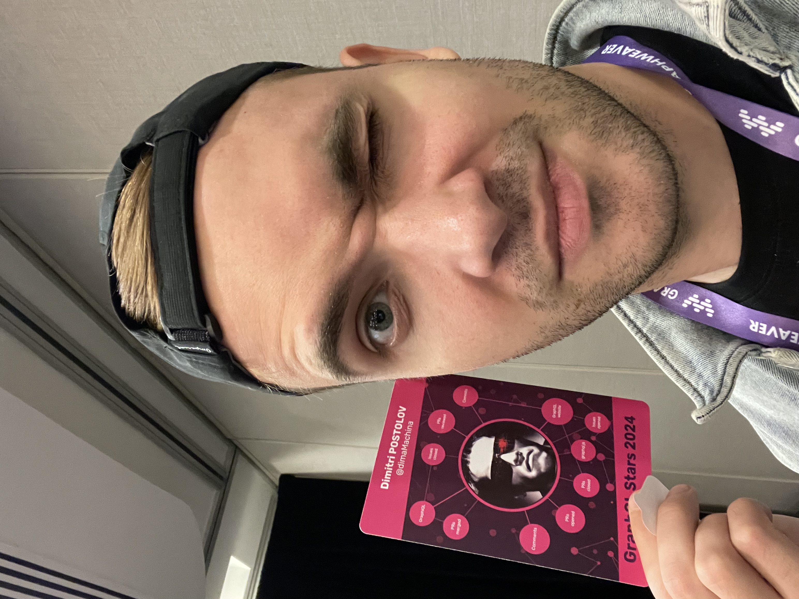</>
<></>

</Grid>

<Bleed>
## GraphQL Conf 2023
<>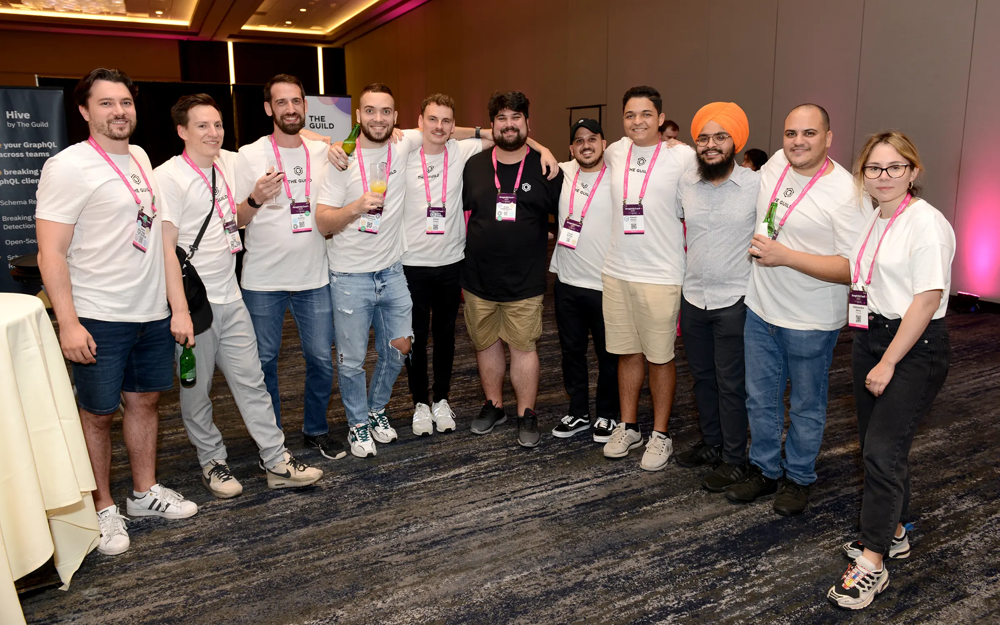</>
</Bleed>

{/* 
 */}

<Bleed>
  ## React Amsterdam 2023
</Bleed>
<Grid>
<></>
<>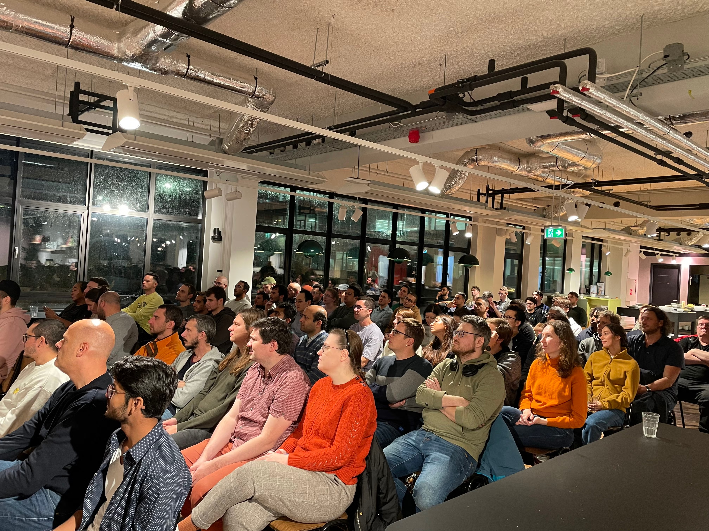</>
<>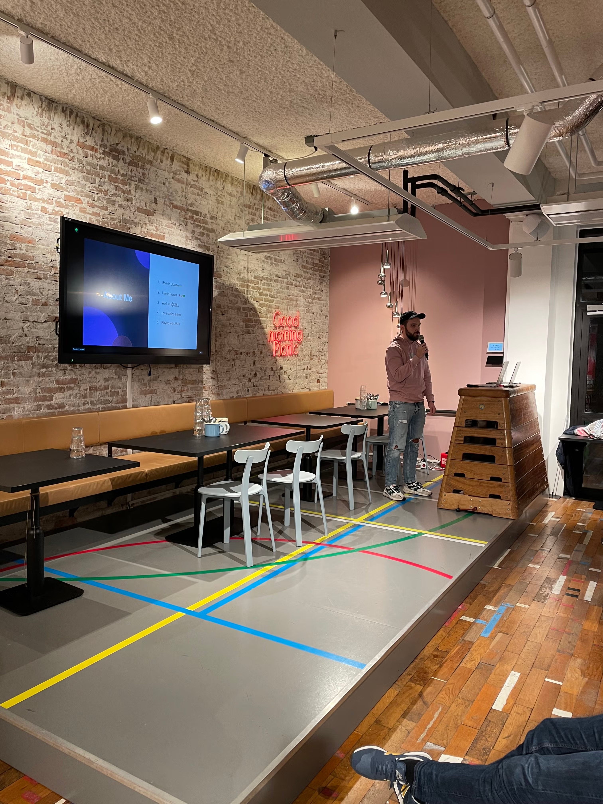</>
<>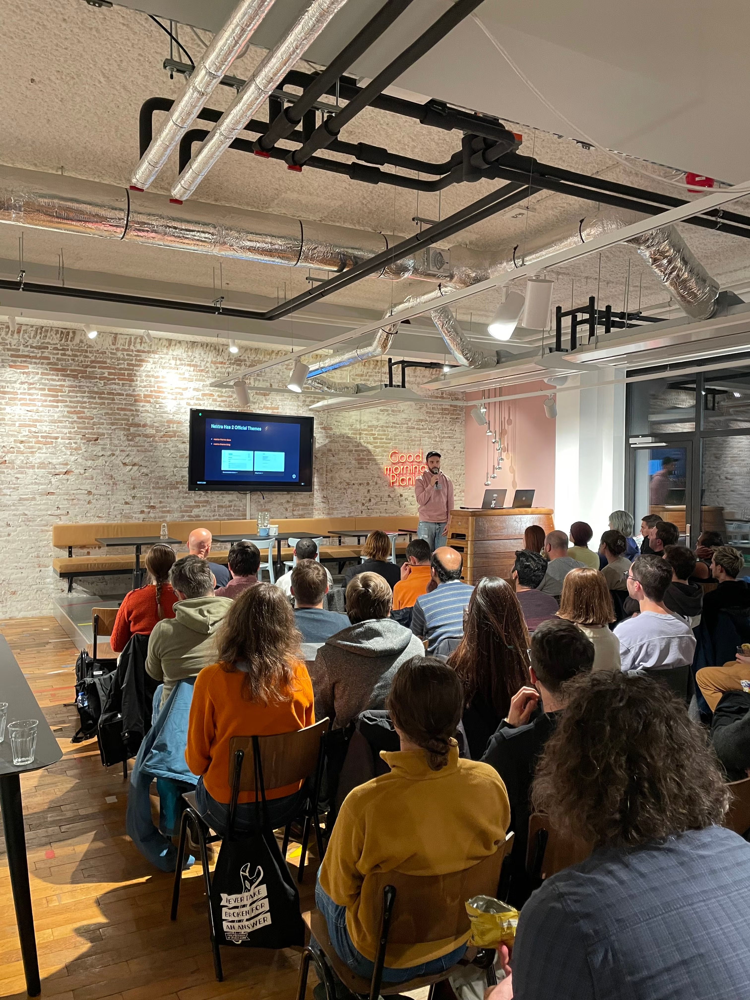</>
<>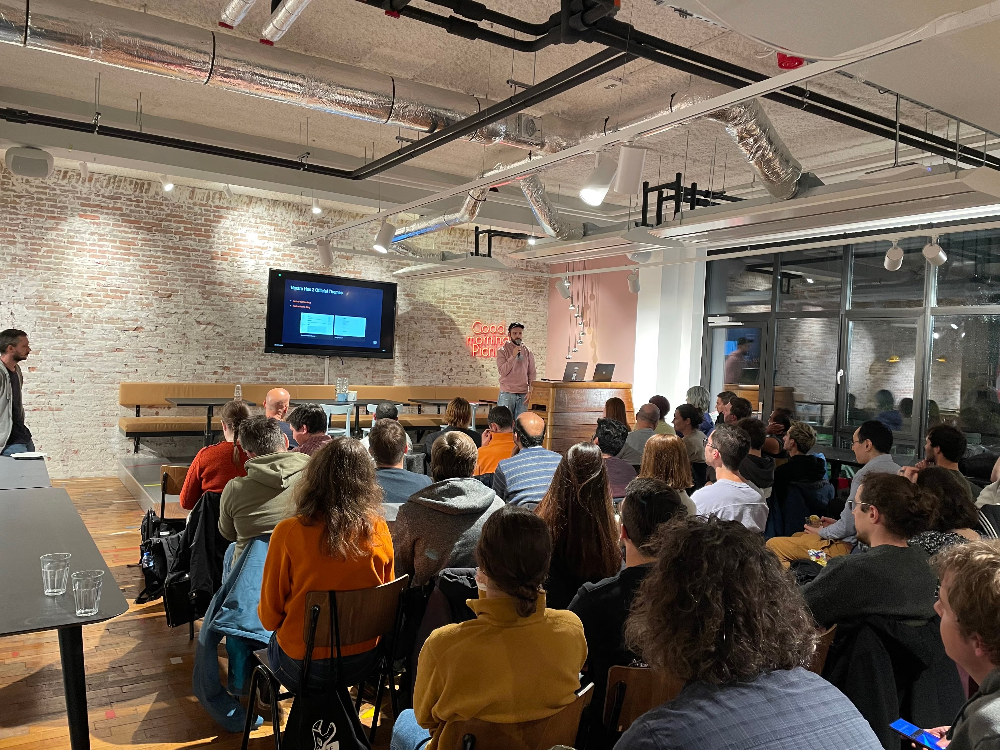</>
<>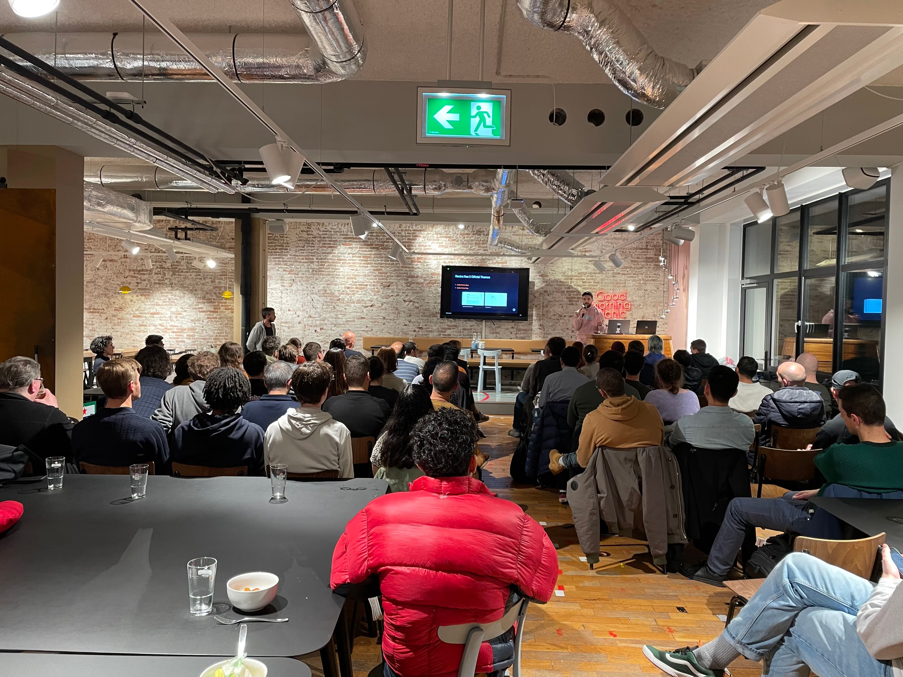</>
<>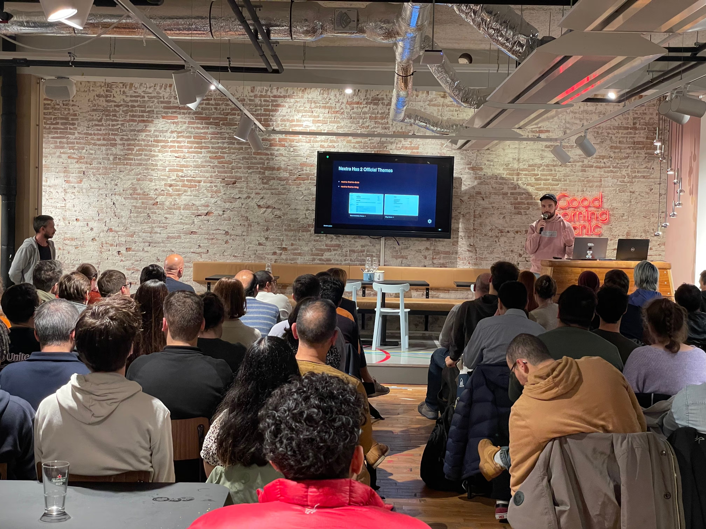</>
<>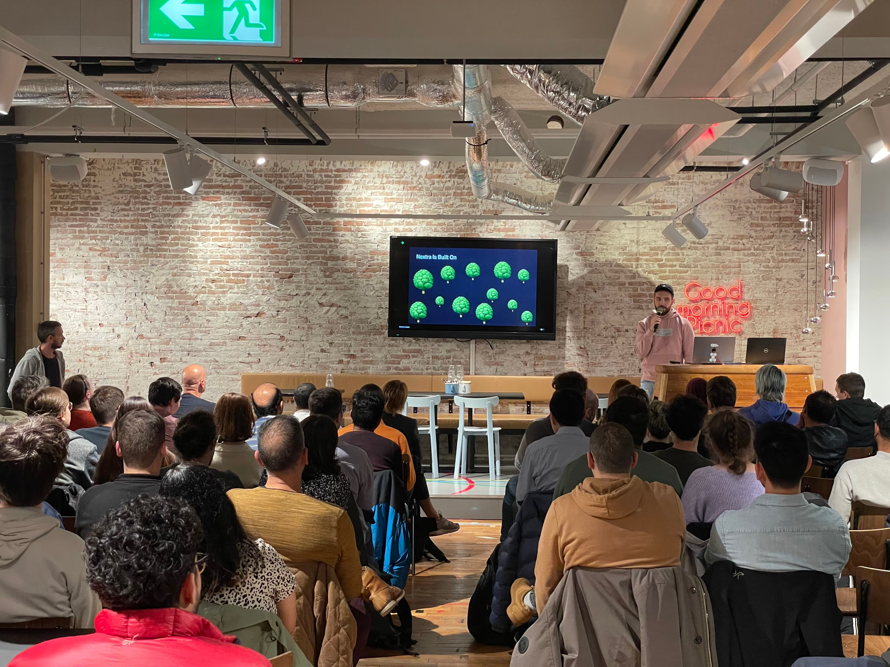</>
<>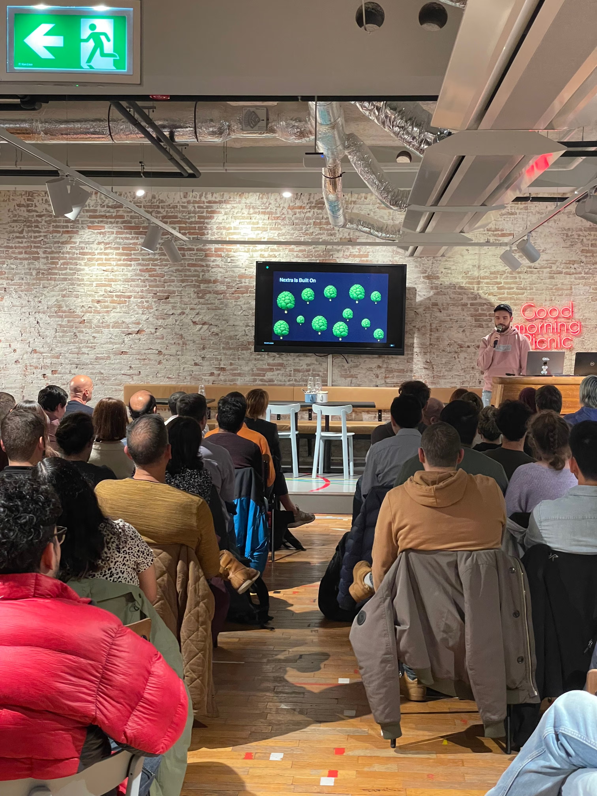</>
<>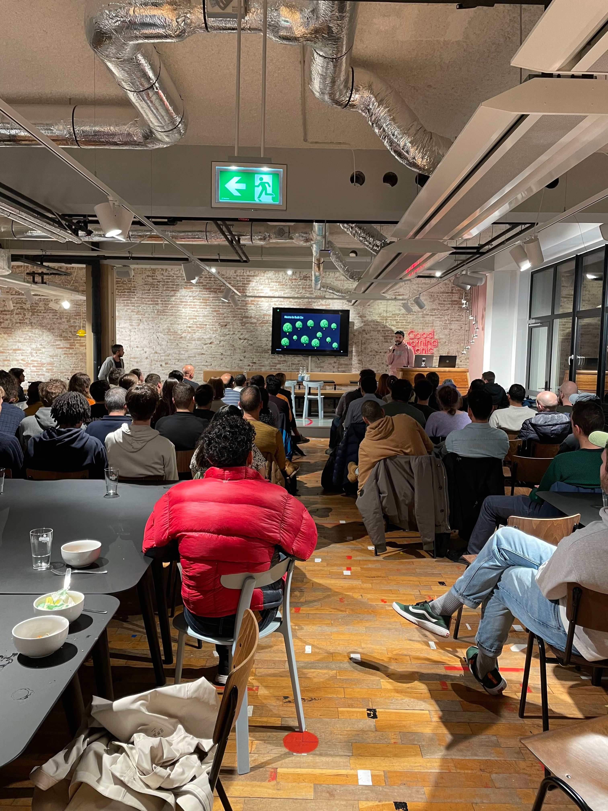</>
<></>
<>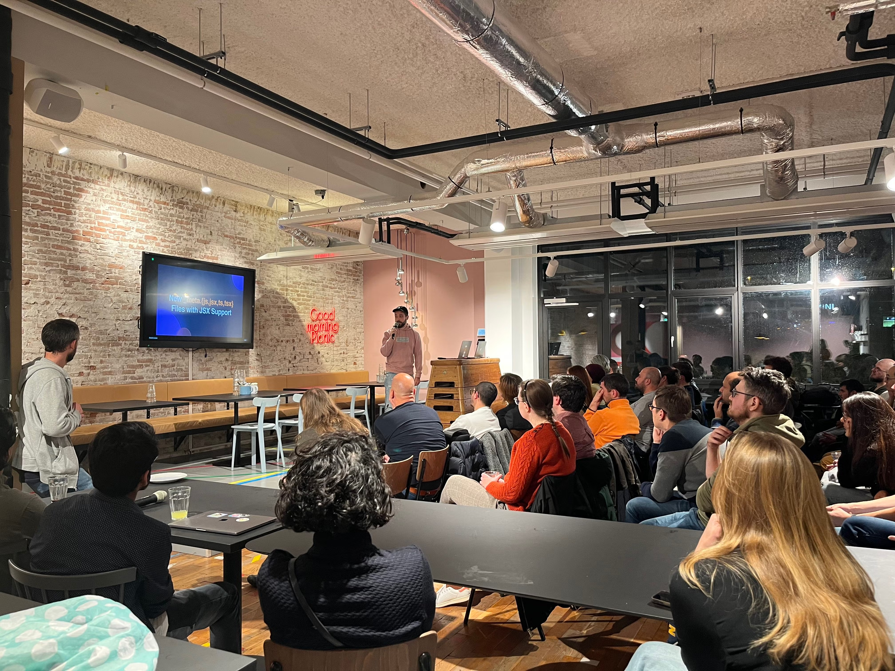</>
<></>
<></>
</Grid>

{/* 
 */}

export function Bleed({ children }) {
  return 
<NextraBleed>{children}</NextraBleed>

}

export function Grid({ children }) {
  return <Bleed>
    <Masonry
    breakpointCols={{ default: 3, 768: 2, 500: 1 }}
    className="flex gap-4"
    columnClassName="masonry-column"
  >
    {children}

  </Masonry>
  </Bleed>
}

export default function MdxLayout(_props) {
  const { img: Image } = useMDXComponents()
  return cloneElement(_props.children, {
    components: {
      img(props) {
        return <Image
          {...props}
          className="rounded-lg shadow-lg mb-4 mt-0"
        />
      }
    }
  })
}
